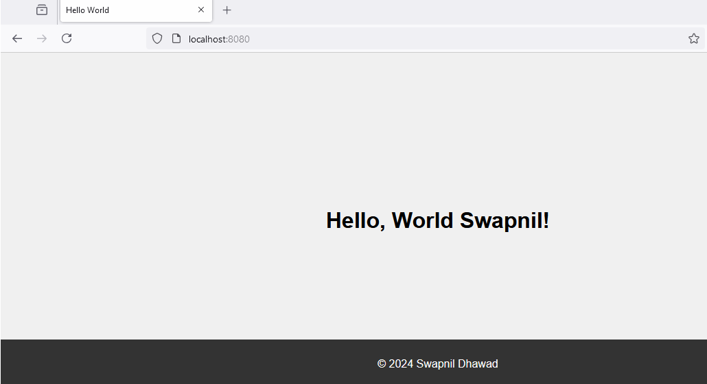
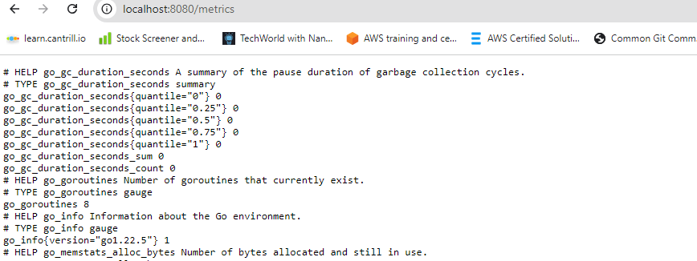
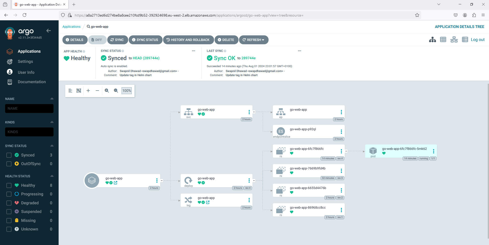

# Golang K8s Demo

his project demonstrates a basic Golang application that delivers a "Hello, World!" page via HTTP. The application is containerized using Docker, uploaded to a Private Amazon Elastic Container Registry (ECR) through a Continuous Integration (CI) pipeline, and deployed to a Kubernetes cluster utilizing Helm and GitOps with Argo CD.

The application also exposes telemetry metrics using Prometheus.

#

## Project Insights

- `main.go`: The main application code.
- `main_test.go`: Unit tests for the application.
- `Dockerfile`: Dockerfile for building the application image. Features added like multistaging build, use distroless image for reducing the size.
- `helm/go-web-app-chart`: Helm chart for deploying the application. Jinja templating for image tag
                            a.Pulling image form Private ECR
                            b. Dynamically updating the image tag 
- `github action workflow CI` : GitHub Actions is used to automate the CI part, including building the application, running tests, linting, security scanning SAST, 
                              pushing the image in private ECR, dynamically updating the tag in deployment.yaml
- `github action workflow integrated with Terraform Cloud` : GitHub Actions is used to automate the deployment of EKS cluster intergrating with TF cloud. 
- `Terraform Cloud` : Terraform is used to provision the EKS cluster in AWS, with the state file managed in Terraform Cloud for governance and TF apply.
- `GitOps` : Argo CD is installed on the EKS cluster to manage GitOps workflows, ensuring continuous synchronization of the deployment with the GitHub repository.

## Features

- Simple HTTP server written in Golang.
- Exposes telemetry metrics using Prometheus.
- Containerized using Docker.
- Deployed to EKS using Helm.
- Uses GitHub Actions for CI/CD pipeline.
- EKS cluster setup using Terraform.
- GitOps with Argo CD for continuous deployment.

## Prerequisites

- Golang 1.22.5 or later
- Docker
- Prometheus
- EKS
- Helm
- Prometheus
- Terraform
- Argo CD

## How to Run the Application

1. Any code commits specific to the application code or Dockerfile will be picked up by the GitHub Action workflow.
   
2. The CI workflow will be triggered and will perform the following actions:
    - Build
    - Unit test cases
    - Linting checks
    - SAST scanning
    - Push to private ECR
3. Image can be fetched from ECR and can be tested locally
   

4. Telemetry metrics
   
   

5. Deployment part is handled via argocd. It is configured with github repo and constantly checking for any changes in specfic to helm charts, it constanlty watches the repo and sync the state available in github repo

   
   
 
