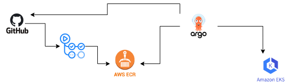
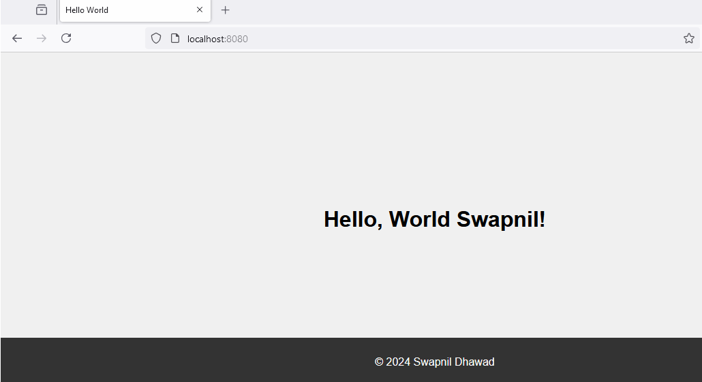
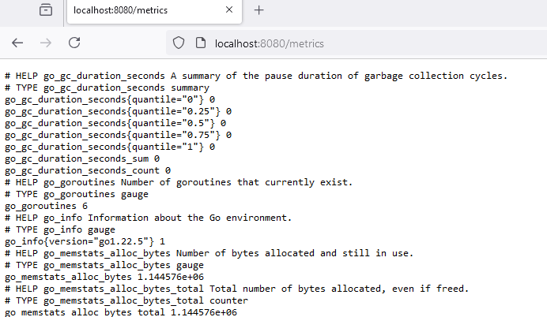
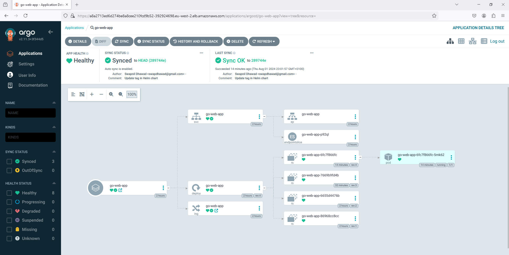
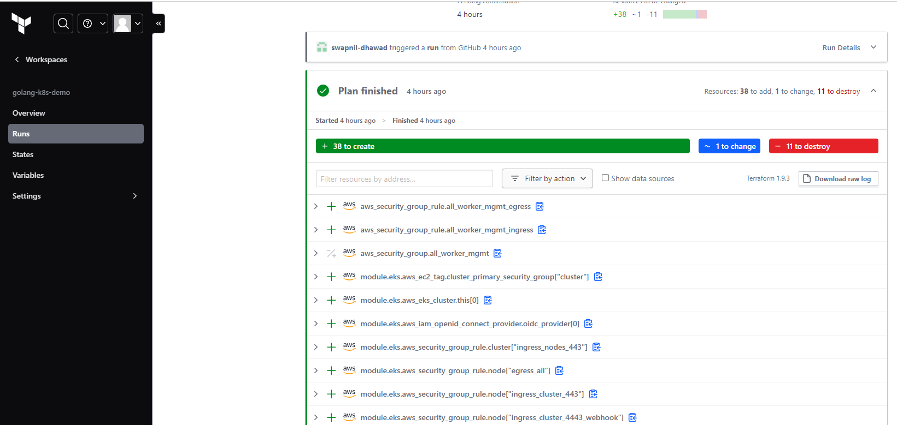

# Golang K8s Demo

This project demonstrates a basic Golang application that delivers a "Hello, World!" page via HTTP. The application is containerized using Docker, uploaded to a Private Amazon Elastic Container Registry (ECR) through a Continuous Integration (CI) pipeline, and deployed to a Kubernetes cluster utilizing Helm and GitOps with Argo CD.

The application also exposes telemetry metrics using Prometheus.

#

## Project Insights

- `main.go`: The main application code.
- `main_test.go`: Unit tests for the application.
- `Dockerfile`: Dockerfile for building the application image. Features added like multistaging build, use distroless image for reducing the size.
- `helm/go-web-app-chart`: Helm chart for deploying the application. Jinja templating for image tag
                            a.Pulling image form Private ECR
                            b. Dynamically updating the image tag 
- `github action workflow CI` : GitHub Actions is used to automate the CI part, including building the application, running tests, linting, security scanning SAST, 
                              pushing the image in private ECR, dynamically updating the tag in deployment.yaml
- `github action workflow integrated with Terraform Cloud` : GitHub Actions is used to automate the deployment of EKS cluster intergrating with TF cloud. 
- `Terraform Cloud` : Terraform is used to provision the EKS cluster in AWS, with the state file managed in Terraform Cloud for governance and TF apply.
- `GitOps` : Argo CD is installed on the EKS cluster to manage GitOps workflows, ensuring continuous synchronization of the deployment with the GitHub repository.

## Features

- Simple HTTP server written in Golang.
- Exposes telemetry metrics using Prometheus.
- Containerized using Docker.
- Deployed to EKS using Helm.
- Uses GitHub Actions for CI/CD pipeline.
- EKS cluster setup using Terraform.
- GitOps with Argo CD for continuous deployment.

## Prerequisites

- Golang 1.22.5 or later
- Docker
- Prometheus
- EKS
- Helm
- Prometheus
- Terraform Cloud
- Argo CD

## How to Run the Application

1. **Code Commits and GitHub Actions:**
    - Any code commits, whether specific to the application code or the Dockerfile, will be detected by the GitHub Actions workflow.

2. **CI Workflow Steps:**
    - Upon triggering, the Continuous Integration (CI) workflow will perform the following actions:
        - Build the application
        - Execute unit test cases
        - Perform linting checks
        - Conduct Static Application Security Testing (SAST)
        - Push the Docker image to a private Amazon Elastic Container Registry (ECR)

3. **Testing the Docker Image Locally:**
    - The Docker image can be fetched from ECR and tested locally.

   

4. **Telemetry Metrics:**
    - Monitor telemetry metrics for application insights.

   

5. **Deployment with ArgoCD:**
    - Deployment is managed via ArgoCD. It is configured with the GitHub repository and constantly checks for any changes specific to Helm charts. ArgoCD continuously watches the repository and synchronizes the state with the configurations available in the GitHub repository.

   

6. **Terraform Cloud for Provisioning EKS Cluster:**
   - A GitHub Action has been configured to trigger the Terraform module responsible for creating the Terraform plan. The state is managed within Terraform Cloud. Once the plan is executed, an administrator can trigger `terraform apply`, which will provision the EKS cluster.

   
