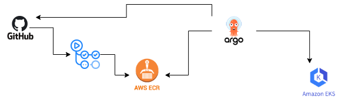

# Golang K8s Demo

This project demonstrates a simple Golang application that serves a "Hello, World!" page over HTTP. It is containerized using Docker and deployed to a Kubernetes cluster using Helm. The application also exposes telemetry metrics using Prometheus.

# Diagaram

## Project Insights

- `main.go`: The main application code.
- `main_test.go`: Unit tests for the application.
- `Dockerfile`: Dockerfile for building the application image. Features added like multistaging build, use distroless image for reducing the size.
- `helm/go-web-app-chart`: Helm chart for deploying the application. Jinja templating for image tag
                            a.Pulling image form Private ECR
                            b. Dynamically updating the image tag 
- `github action workflow CI` : GitHub Actions is used to automate the CI part, including building the application, running tests, linting, security scanning SAST, 
                              pushing the image in private ECR, dynamically updating the tag in deployment.yaml
- `github action workflow integrated with Terraform Cloud` : GitHub Actions is used to automate the deployment of EKS cluster intergrating with TF cloud. 
- `Terraform Cloud` : Terraform is used to provision the EKS cluster in AWS, with the state file managed in Terraform Cloud for governance and TF apply.
- `GitOps` : Argo CD is installed on the EKS cluster to manage GitOps workflows, ensuring continuous synchronization of the deployment with the GitHub repository.

## Features

- Simple HTTP server written in Golang.
- Exposes telemetry metrics using Prometheus.
- Containerized using Docker.
- Deployed to EKS using Helm.
- Uses GitHub Actions for CI/CD pipeline.
- EKS cluster setup using Terraform.
- GitOps with Argo CD for continuous deployment.

## Prerequisites

- Golang 1.22.5 or later
- Docker
- Prometheus
- EKS
- Helm
- Prometheus
- Terraform
- Argo CD

